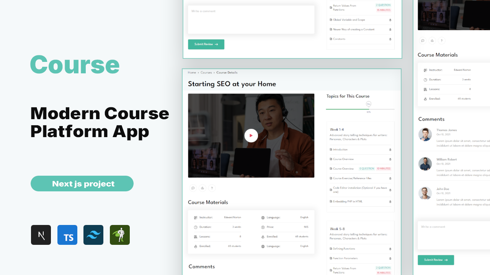

# Course Platform

A modern, fully-responsive course platform built with **React**, **Next.js**, **TypeScript**, **GSAP**, **Tailwind CSS**, and dynamic **API data**. This platform provides an engaging experience for users, showcasing a course roadmap, reviews, leaderboard, and various interactive features.

## Features
- **Course Roadmap**: Displays the structured journey through the course.
- **Video Player**: Professional custom video player with dynamic controls.
- **Video Playlist**: Dynamic playlist fetched from API data.
- **Reviews & Comments**: Dynamic review and comment section loaded from API data.
- **Exam Popups**: Interactive exam popup for quiz-style evaluations.
- **PDF Viewer**: Ability to view course materials in PDF format.
- **Ask the Creator**: Popup to allow users to ask questions directly to the course creator.
- **Leaderboard**: Dynamic leaderboard fetched from API data.
- **Responsive Design**: Fully responsive layout, optimized for all screen sizes.

## Tech Stack
- **React**
- **Next.js**
- **TypeScript**
- **GSAP** (for animations)
- **Tailwind CSS**
- **APIs** (for dynamic data fetching)

## Live Demo
🔗 [visit live site](https://course-teal-ten.vercel.app)

## Let's Work Together

I’m open for custom projects and freelance work!

📩 Reach me at **[yahialord4315@gmail.com](mailto:yahialord4315@gmail.com)**  
or check out my **[portfolio](https://portfolio25-one.vercel.app/)**.

## 📄 License
MIT License © 2025 Yahia Badr
